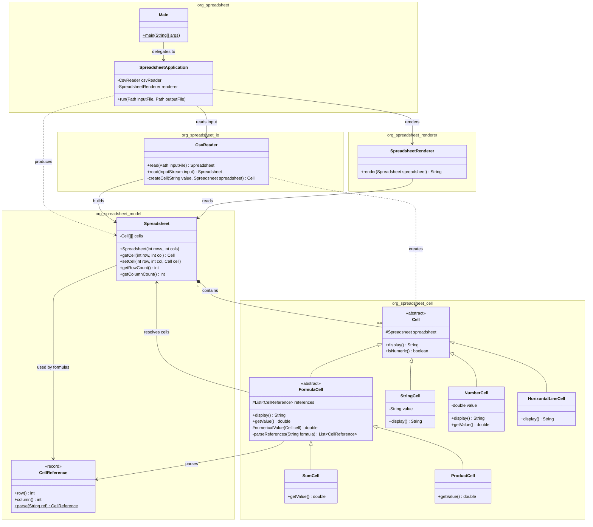
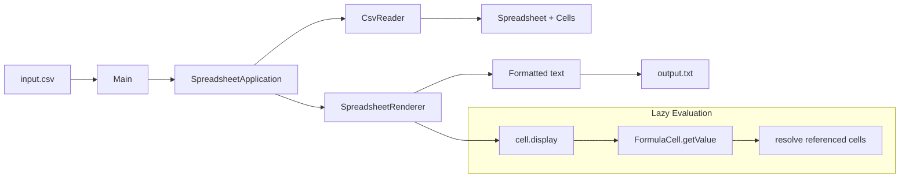

# spread-sheet-coding-project

A Java 17 command-line application that reads a CSV spreadsheet definition, evaluates all cell formulas, and writes the formatted result to a text file.

## Requirements

| Requirement | Status |
|-------------|--------|
| Java command-line app with input + output file parameters | Yes |
| Input: CSV spreadsheet definition | Yes |
| Output: formatted text file after calculation | Yes |
| Standard Java 17 API only (no 3rd-party runtime deps) | Yes |
| Unit tests for all functionality | Yes |
| Gradle build + test runner | Yes |

## Prerequisites

- Java 17+ (Gradle toolchain can provision this automatically)
- Gradle 8.5+ (wrapper included)

## Usage

```bash
./gradlew build

java -jar build/libs/spread-sheet-coding-project-1.0-SNAPSHOT.jar input.csv output.txt
```

Or with Gradle:

```bash
./gradlew run --args="src/main/resources/input.csv output.txt"
```

### Arguments

1. **input.csv** — path to the CSV spreadsheet definition
2. **output.txt** — path where the rendered spreadsheet is written

Example:

```bash
./gradlew run --args="src/main/resources/input.csv build/output.txt"
cat build/output.txt
```

## Build & Test

```bash
./gradlew test
```

Test report: `build/reports/tests/test/index.html`

## Package Structure

```
org.spreadsheet
├── Main.java                    # CLI entry point (input file, output file)
├── SpreadsheetApplication.java  # Orchestrates read → render → write
├── io/
│   └── CsvReader                # Reads CSV from Path or InputStream
├── model/
│   ├── Spreadsheet              # Cell grid
│   └── CellReference            # A1-style coordinate parsing
├── cell/
│   ├── Cell                     # Abstract base
│   ├── StringCell
│   ├── NumberCell
│   ├── FormulaCell              # Abstract formula base
│   ├── SumCell
│   ├── ProductCell
│   └── HorizontalLineCell
└── renderer/
    └── SpreadsheetRenderer      # Column widths + formatted output
```

## Class Diagram



## Processing Flow



## Cell Types

| Raw value | Class | Notes |
|-----------|-------|-------|
| `Hello` | `StringCell` | Left-aligned text |
| `2`, `4.5` | `NumberCell` | Right-aligned number |
| `#hl` | `HorizontalLineCell` | Dashes fill column width |
| `#(sum A1 B2)` | `SumCell` | Sum of referenced cells |
| `#(prod A1 B2)` | `ProductCell` | Product of referenced cells |

## Example Files

| File | Description |
|------|-------------|
| `src/main/resources/input.csv` | Primary example spreadsheet |
| `src/main/resources/input2.csv` | Alternate layout (formulas before data) |

## Design

- **No third-party runtime dependencies** — production code uses only the Java 17 standard library.
- **JUnit 5** is used at test time only (via Gradle).
- **`SpreadsheetApplication`** reads the input CSV, renders the spreadsheet, and writes the output file.
- **`FormulaCell`** evaluates formulas lazily; cells can reference rows defined later in the CSV.

## License

Coding exercise / reference implementation.
